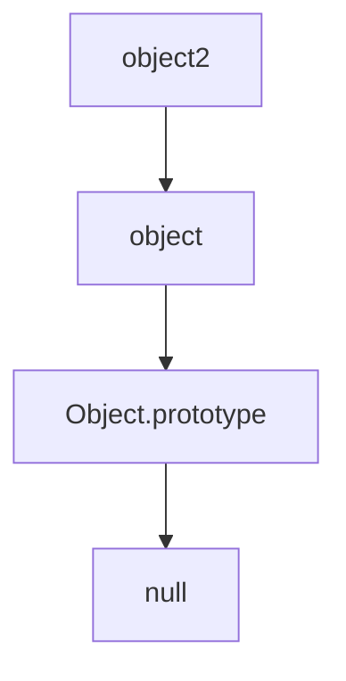

# Prototypes, Prototypal Chain, and Prototypal Inheritance in JavaScript

## Table of Contents
- [Prototypes, Prototypal Chain, and Prototypal Inheritance in JavaScript](#prototypes-prototypal-chain-and-prototypal-inheritance-in-javascript)
  - [Table of Contents](#table-of-contents)
    - [Prototypes](#prototypes)
    - [Prototype and Prototypal Chain:](#prototype-and-prototypal-chain)
    - [Prototypal Chain:](#prototypal-chain)
      - [Summary:](#summary)
    - [Prototypal Inheritance:](#prototypal-inheritance)
      - [Summary:](#summary-1)

---

### Prototypes
<details>
<summary>Basic Example</summary>

-Consider the array `arr` in JavaScript:
```
let arr = ["nan", "sivani"];
```

### Prototype and Prototypal Chain:


In JavaScript, arrays are objects, and like all objects, they have prototypes. The array arr inherits from Array.prototype.

-Here's how this works:

- Array.prototype: The prototype of arrays includes built-in methods like push(), pop(), forEach(), etc.
- Object.prototype: The prototype of Array.prototype itself, containing fundamental methods like toString() and hasOwnProperty().
- When you call a method on arr, JavaScript checks the array itself first, then Array.prototype, and finally Object.prototype.

```js
console.log(arr.length); // Output: 2
console.log(arr.toString()); // Output: nan,sivani
```

-In the first case, length is a property of the array itself. In the second, toString() is found on Array.prototype.

</details>

### Prototypal Chain:
<details>
<summary>Prototype Chain Visualization</summary>
Here’s how the prototype chain looks in this example:

```
mermaid
graph TD
A["arr"] --> B["Array.prototype"]
B --> C["Object.prototype"]
C --> D["null"]
```

- arr has Array.prototype as its immediate prototype.
- Array.prototype has Object.prototype as its prototype.
- Object.prototype has null as its prototype.

#### Summary:

- `Prototype`: A mechanism by which JavaScript objects inherit properties and methods from another object.
- `Prototypal Chain`: The sequence of objects through which property lookups are made. For arr, it's arr → Array.prototype → Object.prototype.
- `Prototypal Inheritance`: The process of inheriting properties from one object to another, allowing for the use of shared methods and properties.
</details>

### Prototypal Inheritance:

<details>
<summary>Inheritance Example</summary>
Let’s explore prototypal inheritance using objects:

```js
let object = {
    name: "nandhu",
    city: "trichy",
    getInfo: function() {
        return `${this.name} lives in ${this.city}.`;
    }
};

let object2 = { 
    name: "Diya"
};

// Setting the prototype
object2.__proto__ = object;

// Accessing properties and methods
console.log(object2.name); // Output: Diya (own property)
console.log(object2.city); // Output: trichy (inherited from object)
console.log(object2.getInfo()); // Output: Diya lives in trichy.

```

Prototype Chain:

#### Summary:

- `Prototypal Inheritance:` object2 inherits from object, gaining access to its properties and methods.
- `Prototype:` object is the prototype of object2.
- `Prototype Chain:` The chain for object2 is object2 → object → Object.prototype → null.
-`__proto__:` This property is used to link object2 to object, establishing inheritance.
</details>
